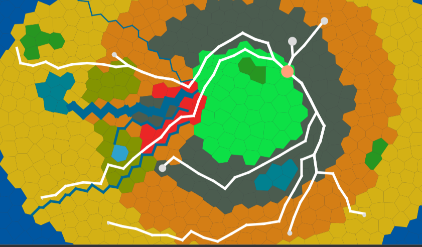

# Assignment A4: Terrain Generator
  - Author: linb44@mcmaster.ca

## Rationale
### City Generation Rationale
Cities are represented as the centroid of land polygons. Since polygons represent a singular section of land with uniform properties, it makes sense for cities to be assigned the centroid and to inherit the properties of the polygon. Segments connecting the centroid (neighbouring relations) are the roads.
For the bonus, cities are rationalized to need flat land around them for establishing initial farmland and then city development, as well as being a set distance away from other cities to avoid overpopulation. Cities grow smaller as they move away lower in height, which is reflected when . The capital city of the island is one of the highest centroids, chosen since a high place is historically more strategically optimal in the dark ages.
### Road Generation Rationale
Roads originally were generated with equal edge weights at 1. This meant that all segments between neighbouring centroids were created equal at first. To support the bonus, the weights of the edges are assigned weights that are functions of height and distance between nodes. Crossing a river during the creation of a road is considered highly expensive, so is generally avoided when possible. Shown below is the result of the rationale, where roads tend stay on the same height level, and avoid crossing rivers.

### Extension Explanation
Island was enriched with and depended on the pathfinder module in order to demonstrate the extendability of features in island. Outside creating the actual logic for adapting to the pathfinder module, implementing roads and cities only needed an addition to the feature bindins of the islandGenerator. Additionally, it was an assignment requirement worth 10% of my mark.
**For best results upon running, use volcano or plains elevation, fertile soil profile and desert biome**

## Installation instructions

This product is handled by Maven, as a multi-module project. We assume here that you have cloned the project in a directory named `A4`

To install the different tooling on your computer, simply run `mvn clean install`

After installation, you'll find:
- an application named `generator.jar` in the `generator` directory
- an application named `island.jar` in the `island` directory
- an application named `visualizer.jar` in the `visualizer` directory.


## Quick-Start Guide
A make file with sample commands has been provided in the root project directory to demonstrate all functionalities. They will create .mesh and .svg files in the `img` directory. The easiest commands to run are:
- `make runfullplains`, Creates a mesh of 1000 polygons and runs a plains elevation profile with 3 lakes, 3 aquifers and 3 rivers. Visualized as island.svg (normal), elevation.svg (elevation heatmap) and moisture.svg (moisture heatmap)
- `make runfullvolcano`, Creates a mesh of 1000 polygons and runs a volcano elevation profile with 3 lakes, 3 aquifers and 3 rivers. Ditto visualization
- `make runfullcrater`, Creates a mesh of 1000 polygons and runs a crater elevation profile with 3 lakes, 3 aquifers and 3 rivers. Ditto visualization
- `make runfullcountry`, Creates a mesh of 1000 polygons and runs an Egypt elevation profile with 3 lakes, 3 aquifers and 3 rivers. Ditto visualization

Separately, the above commands can be split into two parts: the mesh generation, and island generation, and island visualization. The mesh generation commands are:
- `make rung1000`, Creates a mesh of 1000
- `make rung2000`, Creates a mesh of 2000
- `make rung100`, Creates a mesh of 100

The island generation (along with visualization) commands are:
- `make runip`, Runs Plains and creates an elevation and moisture heatmap
- `make runiv`, Runs Volcano and creates an elevation and moisture heatmap
- `make runcountry`, Runs Egypt and creates an elevation and moisture heatmap
- `make runivs`, Runs Volcano and creates an elevation and moisture heatmap with a set seed of 593
- `make runarctic`, Runs Arctic and creates an elevation and moisture heatmap
- `make runforest`, Runs Forest and creates an elevation and moisture heatmap
- `make rundesert`, Runs Desert and creates an elevation and moisutre heatmap


## Individual Run
Below are the commands to run the jar's by oneself

### Individual Run - Generator

To run the generator, go to the `generator` directory, and use `java -jar` to run the product. The product takes up to 6 arguments, the name of the file where the generated mesh will be stored as binary with the option `-mv`, `regular` or `irregular` to determine what kind of mesh is built with the option `-mv`, and an integer value for the length of the side of the mesh with the option `-s`. If a regular mesh is created 1 additional argument follows: an integer value for square sizes `-ss`. If a irregular mesh is created, 2 additional arguments follow: an integer value for number of polygons to be created `-num` and the relaxation level `-ln`.

The following will create a regular 500x500 mesh with 25 vertice square length. These are the default values for a regular mesh as well. 

If a mesh is ran with a square length that is not a factor of the width OR length, the code will not run.

If help is needed with the CLI, please use `-h` after `-mf` and `-mv`, as they are required arguments.

```
mosser@azrael A4 % cd generator 
mosser@azrael generator % java -jar generator.jar -mf sample.mesh -mv regular -s 500 -ss 25
mosser@azrael generator % ls -lh sample.mesh
-rw-r--r--  1 mosser  staff    29K 29 Jan 10:52 sample.mesh
mosser@azrael generator % 
```

The following will create an irregular 500x500 mesh with 200 polygons with a relaxation level of 5
```
mosser@azrael A4 % cd generator 
mosser@azrael generator % java -jar generator.jar -mf sample.mesh -mv irregular -s 500 -num 200 -ln 5
mosser@azrael generator % ls -lh sample.mesh
-rw-r--r--  1 mosser  staff    29K 29 Jan 10:52 sample.mesh
mosser@azrael generator % 
```

## Note that island tests only work if you are in the island directory

### Individual Run - Island 
To run island, go to `island` directory, and use `java -jar` to run the product. This must run after the above section. It takes up to 10 arguments in no particular order.
- `i`, Specifies the relative address of the input mesh file
- `o`, Specifies the relative address of the output mesh file 
- `shape`, Specifies the shape profile of the island, options are `circle`, `star`, `country`, `oval`
- `altitude`, Specifies the elevation profile of the island, options are `plains`, `volcanic`, `crater`
- `seed`, Specifies the seed the island generates with
- `lake`, Specifies the maximum amount of lakes
- `river`, Specifies the maximum amount of rivers
- `aquifer`, Specifies the maximum amount of aquifers
- `biomes`, Specifies the ecosystem the island is made of, options are `arctic`, `forest`, `desert`, or `default` (you can also leave the field blank for default)
- `cities`, Specifies the number of cities to be included in the island generation. Shows up in the other render views as well
- `help`, Provides help

Sample runs are provided below:
- `java -jar island.jar -help`, Basic help command
- `java -jar island.jar -i ../img/new.mesh -o ../img/island.mesh -altitude volcanic -shape circle -lake 3 -aquifer 3 -river 3`, Creates new island mesh
- `java -jar island.jar -i ../img/new.mesh -o ../img/island.mesh -altitude volcanic -shape star -seed 69 -lake 3 -aquifer 3 -river 3`, Creates new island mesh with set seed

### Individual Run - Visualizer

To visualize an existing mesh, go the `visualizer` directory, and use `java -jar` to run the product. These must be run after the above two sections. The product take up to 3 arguments.
- `i` The file containing the mesh
- `o`, The name of the file to store the visualization (as an SVG image)
- `mode`, The mode of the visualization, options are `debug`, `graphic`, `haltitude`, `hmoisture`
- `help`, For help

```
mosser@azrael A4 % cd visualizer 
mosser@azrael visualizer % generator.jar -mf sample.mesh -mv irregular

... (lots of debug information printed to stdout) ...

mosser@azrael visualizer % ls -lh sample.svg
-rw-r--r--  1 mosser  staff    56K 29 Jan 10:53 sample.svg
mosser@azrael visualizer %
```


